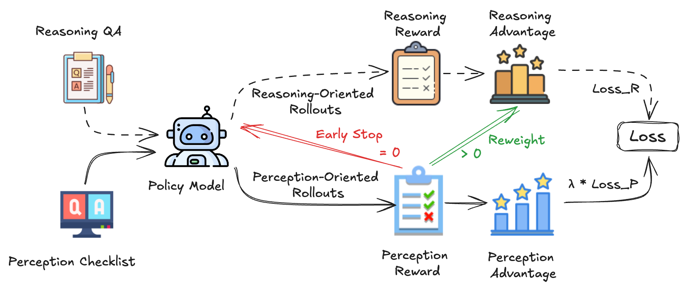

<br />
<div align="center">
  <a href="https://github.com/MiliLab/PEARL">
    
  </a>

  <h3 align="center">PEARL</h3>

  <p align="center">
    Perceptual-Evidence Anchored Reinforced Learning for Multimodal Reasoning
    <br />
    <a href="https://github.com/MiliLab/PEARL">Paper (Coming Soon)</a>
    &middot;
    <a href="https://huggingface.co/Rex1090/PEARL-7B">Model</a>
    &middot;
    <a href="https://huggingface.co/Rex1090/PEARL-7B">Dataset (Coming Soon)</a>
  </p>
</div>

## About PEARL
PEARL (Perceptual-Evidence Anchored Reinforced Learning), a dual-branch, perception-reasoning synergistic that strengthens multimodal reasoning by explicitly anchoring it to verified visual evidence. 

<p align="center">
    
</p>

## ToDo

- [x] Inference Code of PEARL-7B (Based on Qwen2.5-VL-7B)
- [ ] Training Code of PEARL
- [ ] PEARL-3B (Based on Qwen2.5-VL-3B), PEARL-32B (Based on Qwen2.5-VL-32B)
- [ ] PEARL-8B (Based on Qwen3-VL-8B)
- [ ] Perception Probes ([ViRL39k](https://huggingface.co/datasets/TIGER-Lab/ViRL39K), [Geo3k](https://huggingface.co/datasets/hiyouga/geometry3k), [MMK12](https://huggingface.co/datasets/FanqingM/MMK12/viewer/default/train?p=2))

## Evaluation
We use [VLMEvalKit](https://github.com/open-compass/VLMEvalKit) for evaluation, please see [VLMEvalKit](https://github.com/open-compass/VLMEvalKit) for enviornment installation. 

```bash
git clone https://github.com/open-compass/VLMEvalKit.git
cd VLMEvalKit
pip install -e .
```
For reference, our settings are: transformers==4.53.3, vllm==0.9.2, torch==2.7.0.

After installation, copy the provided files into VLMEvalKit/vlmeval/vlm/qwen2_vl or create a new directiony.
Our inference configuration is as follows:
```python
"PEARL_7B": partial(
        Qwen2VLChat,
        model_path="",
        min_pixels=1280 * 28 * 28,
        max_pixels=16384 * 28 * 28,
        use_custom_prompt=False,
        max_new_tokens=8192,
        post_process=True,
        use_vllm=True
    )
```
setting ```post_process=False``` may change the reported scores.

GPT-4.1 is employed as the judge for answer assessment. For benchmarks that rely on exact matching in VLMEvalKit (with the exception of WeMath), we perform an additional round of LLM-based evaluation after the exact-match filtering. The prompting template is:
```
def build_gpt4_score_prompt(line,gt):
    prompt = """
        You are given a statement that contains a specific piece of information, and your task is to determine if this information matches the expected answer. Please follow the steps below:

        1. Extract the most relevant piece of information from the following statement:
        "{model_output}"

        2. Compare the extracted information to the expected answer "{expected_answer}".

        3. Return one of the following results:
        - "Correct" if the extracted information exactly matches the expected answer.
        - "Incorrect" if the extracted information does not match the expected answer.

        Please focus on the core information in the sentence (e.g., a date, an event, a specific term) that matches the expected answer, using a relaxed accuracy, such as 60% and 0.6 are considered match.

        For numerical answers:
        - Ignore differences in formatting, such as commas, spaces, or periods.

        For non-numerical answers:
        - Consider variations like near-synonyms or small spelling differences as matches.
        """
```

You may then obtain results by running the scripts provided in VLMEvalKit.
